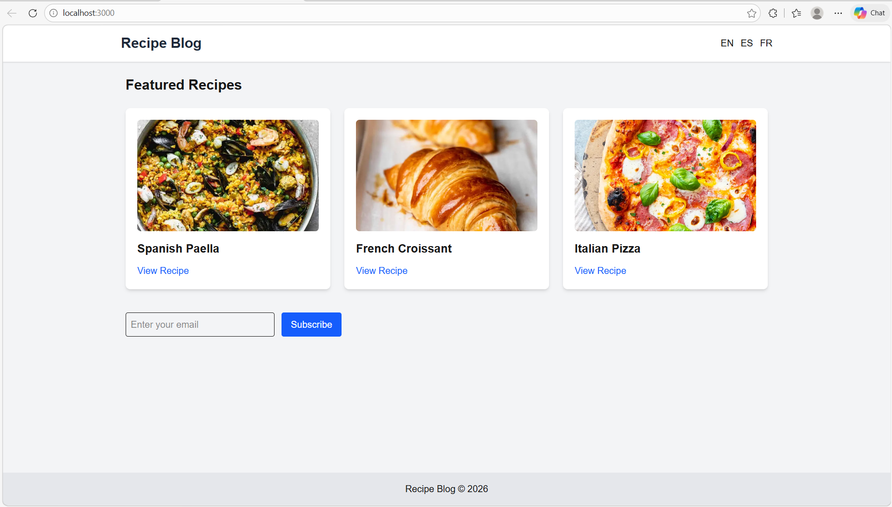
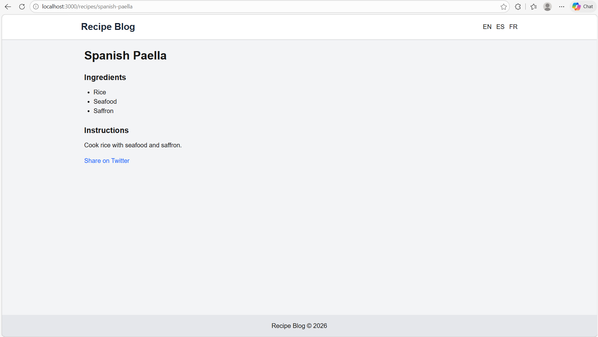
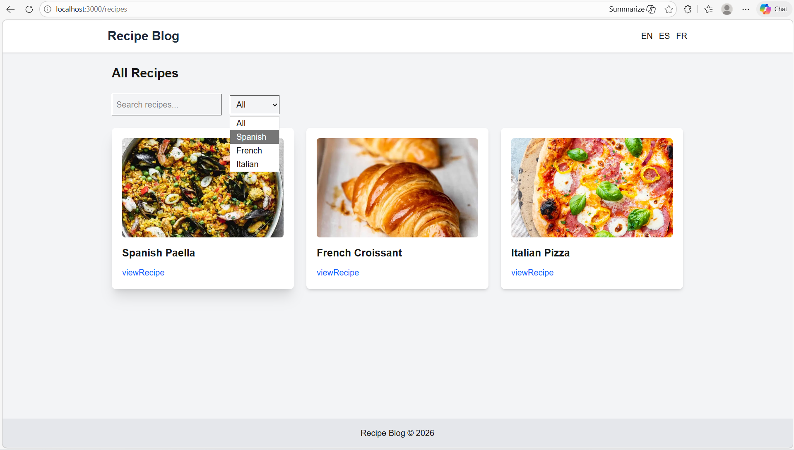

# Internationalized Recipe Blog (Next.js)

##  Project Overview

This project is a **multi-language recipe blog** built using **Next.js**. It demonstrates modern web development concepts such as:

* Static Site Generation (SSG)
* Internationalization (i18n)
* SEO optimization
* Docker containerization
* Client-side search and filtering

The application allows users to explore recipes in **English, Spanish, and French**, view recipe details, and subscribe to a newsletter.

---

#  Features

###  Multi-language Support

The application supports three languages:

* English (default)
* Spanish
* French

Users can switch languages using the language switcher available on all pages.

---

###  Recipe Listing

The **Recipes page** shows all available recipes with:

* Search functionality
* Category filtering
* Recipe cards with images

---

###  Recipe Detail Page

Each recipe page includes:

* Recipe title
* Ingredients list
* Cooking instructions
* Social sharing button

All content is localized according to the selected language.

---

###  Search & Filtering

Users can:

* Search recipes by name
* Filter recipes by category

This functionality works entirely on the **client side**.

---

###  Newsletter Subscription

Users can subscribe using the newsletter form.

Validation includes:

* Email format validation
* Error message display
* Success confirmation message

---

###  Image Optimization

Images are rendered using the **Next.js Image component**, enabling:

* Automatic optimization
* Responsive loading
* Performance improvements

---

###  Social Sharing

Each recipe page includes a **Twitter share button** that allows users to share recipes easily.

---

###  SEO Optimization

The project generates a **sitemap.xml** file to help search engines index the site efficiently.

Accessible at:

```
http://localhost:3000/sitemap.xml
```

---

###  Print Friendly Recipe Page

When printing a recipe page:

* Header is hidden
* Footer is hidden
* Navigation is hidden

Only the recipe content is displayed for clean printing.

---

#  Docker Setup

The project is fully containerized using **Docker and Docker Compose**.

### Run the application

```
docker-compose up --build
```

Then open:

```
http://localhost:3000
```

---

#  Environment Variables

Example variables are provided in:

```
.env.example
```

Example:

```
CMS_PROVIDER=contentful
CONTENTFUL_SPACE_ID=your_space_id
CONTENTFUL_ACCESS_TOKEN=your_access_token
```

---

#  Project Structure

```
recipe-blog
│
├── components
├── pages
├── public
│   └── locales
├── styles
├── scripts
├── Dockerfile
├── docker-compose.yml
├── next-i18next.config.js
├── package.json
└── README.md
```

---

#  Screenshots

### Homepage (English)



---

### Homepage (Spanish)


---

### Homepage (French)


---

### Recipe Detail Page



---

### Search & Filtering



---

### Newsletter Validation


---

#  Project Demo Video

A short demonstration video explaining the project features.

Demo Video: https://drive.google.com/file/d/1JJu9jJqRqoy8PK9zdoh3PxseMDFB1xWu/view?usp=sharing

---

#  Tech Stack

* Next.js
* React
* Tailwind CSS
* next-i18next
* Docker

---

#  How to Run Locally

1. Install dependencies

```
npm install
```

2. Run development server

```
npm run dev
```

3. Open browser

```
http://localhost:3000
```

---


